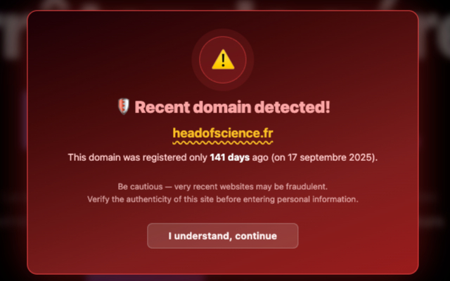

<p align="center">
  
</p>

<h1 align="center">🛡️ Young Domain Guard</h1>

<p align="center">
  A browser extension that alerts you when visiting websites with recently registered domain names.
</p>

<p align="center">
  <a href="https://addons.mozilla.org/en-US/firefox/addon/young-domain-guard/">
    
  </a>
  <a href="https://chromewebstore.google.com/detail/young-domain-guard/hhkcimdgkdddoiimfgdhfelplkaogppg">
    
  </a>
</p>

---

## 🤔 Why?

Phishing and scam domains are created and abandoned constantly — most live less than a month before being taken down and replaced. Traditional blacklists can't keep up because new malicious domains appear faster than they can be catalogued.

Young Domain Guard takes a different approach: instead of maintaining an ever-outdated blocklist, it checks the **age** of the domain you're visiting. If the domain was registered recently (default: less than 30 days), you get a warning. Simple, effective, and always up to date.

## ⚙️ How It Works

1. 🌐 You visit a website
2. 🔍 The extension queries [RDAP](https://rdap.org) (Registration Data Access Protocol) for the domain's registration date
3. 🚨 If the domain is younger than your configured threshold, a warning banner appears on the page and the extension icon turns red
4. ✅ Older domains show a green "safe" indicator

Results are cached for 4 hours to avoid repeated lookups. Major well-known domains (Google, GitHub, Amazon, etc.) are automatically skipped.

<p align="center">
  
</p>

## ✨ Features

- 📅 Configurable age threshold (1–365 days, default 30)
- ⚠️ Visual warning banner injected directly into suspicious pages
- 🔴🟢 Extension icon badge shows status at a glance (red/green/gray)
- 📊 Popup with detailed domain info: registration date and exact age
- 🌍 Smart multi-level TLD handling (`.co.uk`, `.com.au`, etc.)
- 🧩 Works on Chrome, Brave, and Firefox

## 📥 Installation

### From store

- 🦊 **Firefox**: [Young Domain Guard on Firefox Add-ons](https://addons.mozilla.org/en-US/firefox/addon/young-domain-guard/)
- 🌐 **Chrome/Brave**: [Young Domain Guard on Chrome Web Store](https://chromewebstore.google.com/detail/young-domain-guard/hhkcimdgkdddoiimfgdhfelplkaogppg)

### From source

1. Clone the repository
2. Install dependencies and build:

   ```bash
   npm install
   npm run build
   ```

3. Load the extension in your browser:
   - **Chrome/Brave**: Go to `chrome://extensions`, enable "Developer mode", click "Load unpacked", and select the `build` folder
   - **Firefox**: Go to `about:debugging#/runtime/this-firefox`, click "Load Temporary Add-on", and select `build/manifest.json`

## 🛠️ Development

```bash
npm run dev
```

This runs the TypeScript compiler in watch mode, recompiling on file changes. Reload the extension in your browser after changes.

## 🎛️ Configuration

Click the extension icon to open the popup, where you can:

- 📋 See the current domain's status and registration date
- 🔧 Adjust the age threshold (in days) for triggering warnings

## 📄 License

MIT
